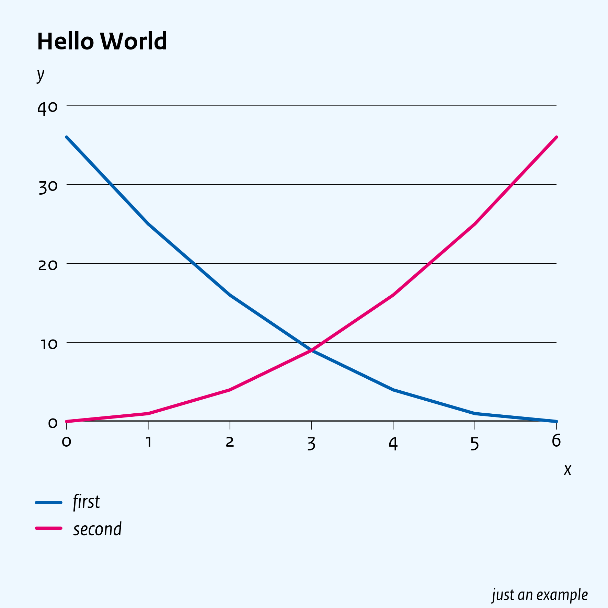
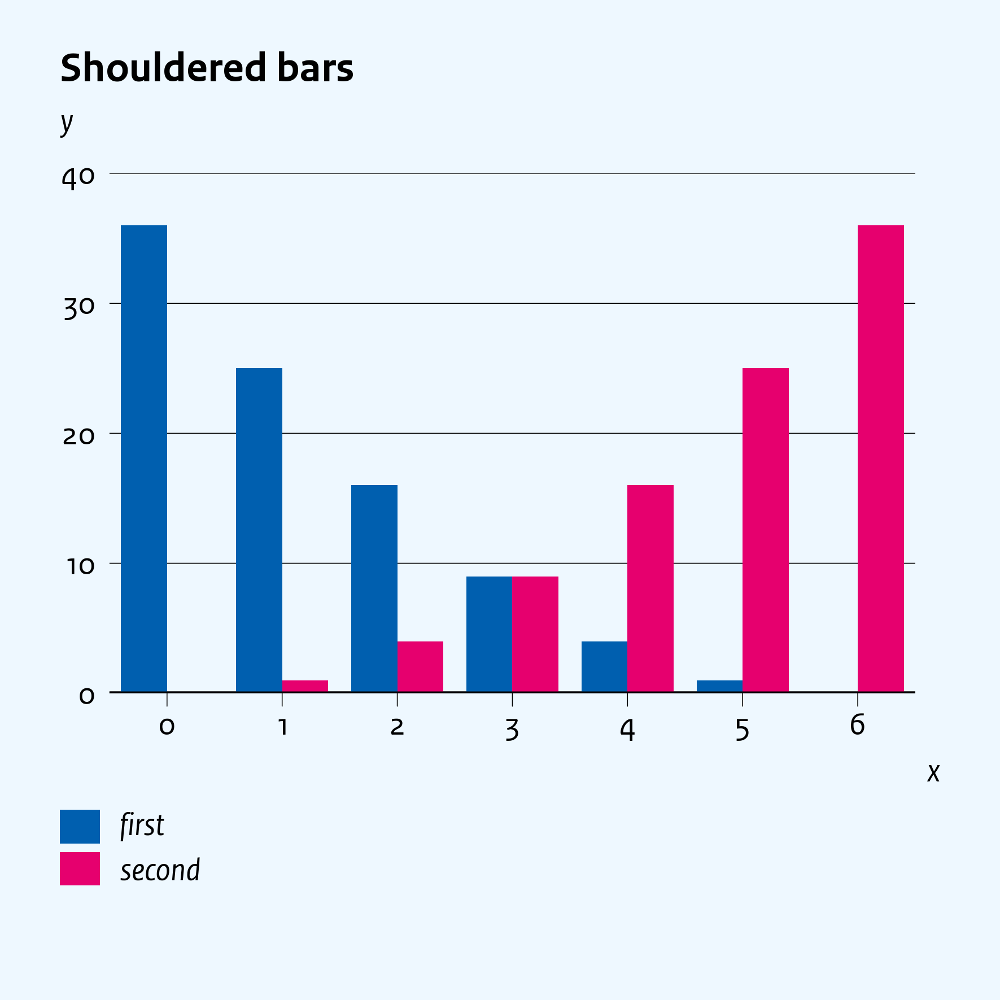
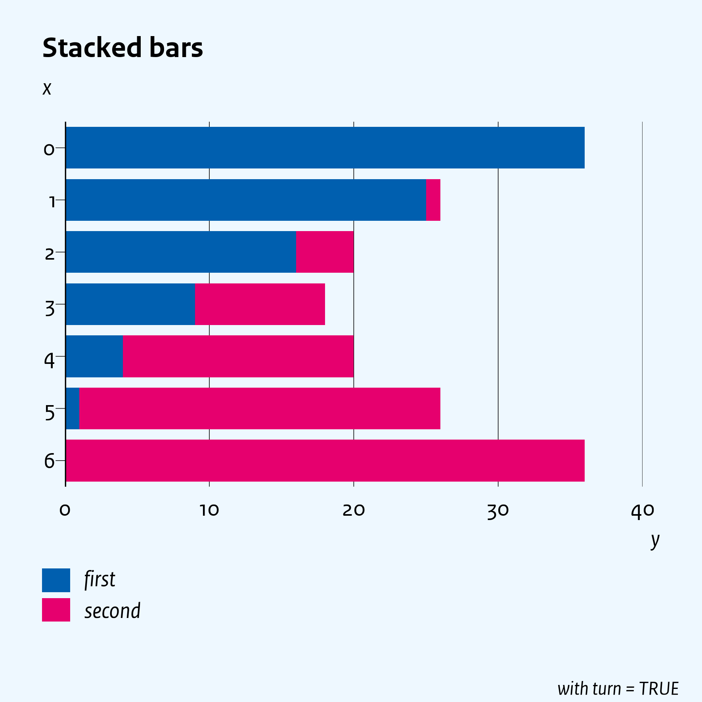

Time series data visualisation made easy for Excel users and R programmers. 

<!-- badges: start -->
[](https://github.com/data-science-made-easy/nicerplot/actions)
<!-- badges: end -->

- [Installation](#installation)
- [Hello World example](#hello-world-example)
  * [Change the layout](#change-the-layout)
- [Manual](#manual)
  * [Details](#details)

# Installation
1. Download [RStudio](https://www.rstudio.com) or [R](https://cran.r-project.org/).
2. Open RStudio or R, and install the package `devtools` if you don't have it already:
   ``` R
   install.packages("devtools", repos = "http://cran.us.r-project.org")
   ```
3. With the `devtools` package you can install `nicerplot` directly from github.
   ``` R
   devtools::install_github("data-science-made-easy/nicerplot")
   ```

Congratulations, you now have the cutting-edge development version of `nicerplot`!

In some cases, however, *e.g.* if you want work on common version together with others, you may prefer to install a [stable release](https://github.com/data-science-made-easy/nicerplot/releases). In that case you can add `ref = <tag>`, to the above `install_github` command. You can find the [tag](https://github.com/data-science-made-easy/nicerplot/tags) left of the [release](https://github.com/data-science-made-easy/nicerplot/releases) (*e.g.* `ref = 'v0.1.1'`).

# Hello World example
The example below defines a `data.frame` with two series of data:
``` R
x <- 0:6
d <- data.frame(x, first = (6 - x)^2, second = x^2)
nicerplot::nplot(d, title = 'Hello World', x_title = 'x', y_title = 'y', footnote = "just an example")
```

This generates a figure in`./generated/hello-world.png` in your working directory (see: `getwd()`):



Nicerplot can visualise data in the following objects:
- `data.frame`, see the above example
- `matrix`, similar to `data.frame`
- `ts`, `mts`, (multivariate) time series objects
- `character`, if it is a 'path/to/an-Excel-file.xlsx'
  - *e.g.*, `nplot('hello-world.xlsx')` reproduces the above figure (first download [hello-world.xlsx](https://github.com/data-science-made-easy/nicerplot/raw/master/inst/extdata/examples/xlsx/hello-world.xlsx))
- `character`, if it is a URL that points to data on [Statistics Netherlands](https:://cbs.nl)
  - *e.g.* `nplot('https://opendata.cbs.nl/statline/#/CBS/nl/dataset/83913NED/table?dl=323FD', title = 'Dutch housing market', hline_bold = 100, y_title = 'prices (2015 = 100)', file = 'url-example')` plots actual house prices and saves it as 'url-example.png'
- `list`, with elements of the above objects and/or a 'sub-`list`'

The <a href="https://htmlpreview.github.io/?https://github.com/data-science-made-easy/nicerplot/blob/master/inst/extdata/nicerplot-manual.html" target="_blank">manual</a> explains in great detail how to structure the above objects well.

## Change the layout
Instead of lines you can plot 'stacked bars' by using parameter `type = 'bar='` (use `type = 'bar--` for shouldered bars):

``` R
library(nicerplot) # this exports function 'nplot()'
nplot(d, title = 'Shouldered bars', x_title = 'x', y_title = 'y', type = 'bar--', file = 'Hello-World-shouldered-bars')
nplot(d, title = 'Stacked bars', x_title = 'x', y_title = 'y', footnote = 'with turn = TRUE', type = 'bar=', file = 'Hello-World-stacked-bars', turn = TRUE)
```

 

# Manual
The <a href="https://htmlpreview.github.io/?https://github.com/data-science-made-easy/nicerplot/blob/master/inst/extdata/nicerplot-manual.html" target="_blank">manual</a> provides many other examples. Below each figure in this manual you can find the R-code to reproduce that figure. Please ignore the file paths in the manual.

## Details
The default

- font is 'RijksoverheidSansText'. If that font is unavailable, 'sans' will be selected.
- language is Dutch, so the decimal (thousand) separator is a comma (point). Use `style = 'english'` to swap those two separators.
